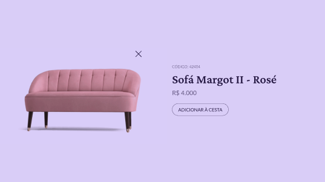

# Bora Codar 02

Bora Codar são projetos semanais propostos pela [@Rocketseat](https://www.rocketseat.com.br/) com o objetivo de criar seu portfólio e interagir nas redes sociais melhorando seu networking.
O segundo [bora codar](https://boracodar.dev/#) é um card de Produto.

## O Projeto

Um card de Produto com HTML e CSS.

[Layout no figma](https://www.figma.com/file/5EVESrC2dRewkW6kSHZrhb/%23boraCodar---Desafio-2-(Copy)?node-id=0%3A1&t=PAY5mkqdRRpyfVLP-0)

